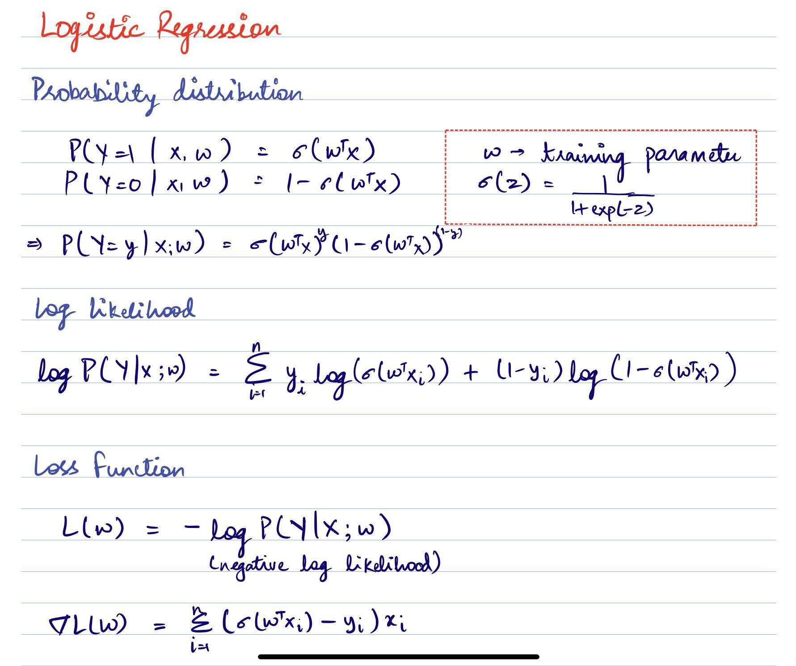
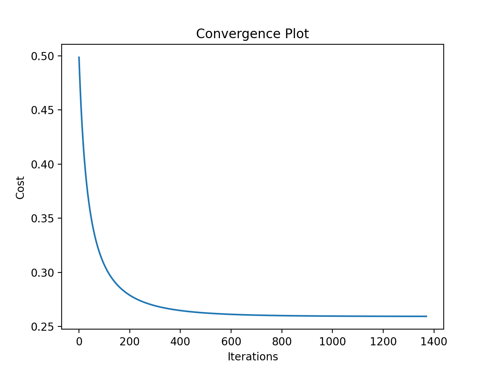
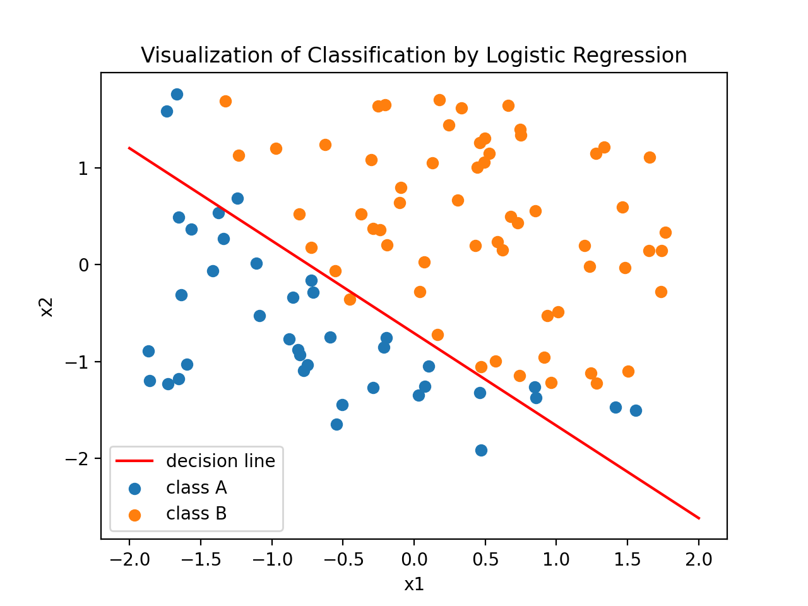
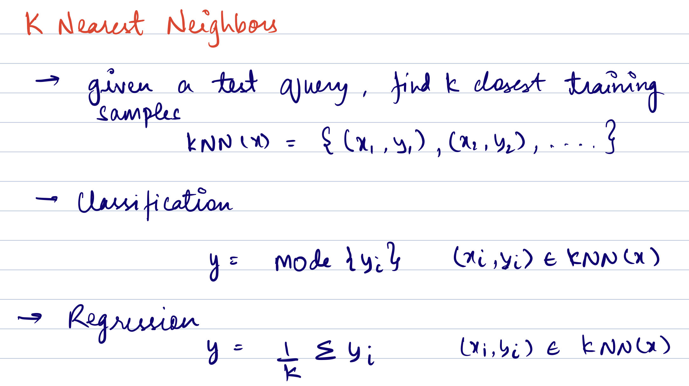

# MLFromScratch
Implementation of widely used ML techniques from scratch

## Contents
- [Logistic Regression](#logistic-regression)
    - [Binary Classification](#binary-classification)
- [K-Nearest Neighbors](#k-nearest-neighbors)
- [Bag of Words](#bag-of-words)

## Logistic Regression

_keywords : classification, supervised learning, discriminative model, non-linear, gradient descent._

Opposed to its name, logistic regression is a supervised learning algorithm used for classification. 

### Binary Classification

- [This](logistic-regression/logistic_regression.py) file contains the implementation of a binary class logistic regression algorithm. 
- The algorithm uses binary cross-entropy loss function. The loss function and its gradient implementation can be found [here](cost_func.py).
- Since it is a **non-linear formulation**, there is no closed form solution and descent methods are used to get to the loss function minimizer. It's worth mentioning here that the [model itself is linear](https://sebastianraschka.com/faq/docs/logistic_regression_linear.html)

 

Left: Convergence of loss function value, Right: Discriminator learned from training data.

**Pros**
- Easy to implement and understand.
- Doesn't overfit easily. 
- No assumptions about the distribution of data (discriminative).

**Cons**
- It has linear decision surface.
- 

### Potential Questions
- What is the nature of the decision boundary produced by logistic regression? Linear or non-linear?
- Why is MSE not suitable as cost function for logistic regression?

## K-Nearest Neighbors

_keywords : classification, regression, supervised learning, non-parametric_

K-nearest neighbors algorithm predicts a lable/value by voting amongst the k closest neighbors to the point in question. In classification the most frequent label is considered and in regression an average is taken. There are two hyperparameters to be decided - k and distance metric (l2 norm, l1 norm etc.). k acts as a smoother.

- [This](knn/knn.py) file consists the implementation of knn using l2 (euclidean) norm. 
- For each test data point, the algorithm has to calculate distances from all the training samples.

**Pros**
- Intuitive
- Easy to implement
- Minimal hyperparameters

**Cons**
- Computationally expensive
- Sensitive to outliers
- Doesn't perform well on imbalanced data
- Curse of dimensionality

### Potential questions
- How to decide on the k value? Would you prefer an odd or an even value?
- Would decision boundary change with varying distance metrics?
- How is the value of k related to bias-variance tradeoff?
- KNN vs QDA?
- How does test and train error vary with increasing k?
- What would be the training error for k=1?

## Linear Regression

_keywords : regression, supervised learning, parametric_

Probably the most common regression technique out there. 

- [This](linear-regression/LinearRegression.py) file implements the non-regularised solution to least squares using both gradient descent and closed form solution. 

## Bag of Words

_keywords : NLP, embeddings_

Bag of Words is a type of text analysis technique used to look at the frequency of words used in a given text. It is commonly used in natural language processing (NLP) and data mining applications. The technique involves creating a histogram of all the words in a given text, disregarding the order and structure of the words. This is why it is called a Bag of Words.

A simple implementation of BoW can be found [here](bag-of-words/bow.py)

**Pros**
- 

**Cons**
- As the corpus gets bigger, dimension of feature vector also increases. This eventually leads to the phenomenon of curse of dimensionality. 
- 